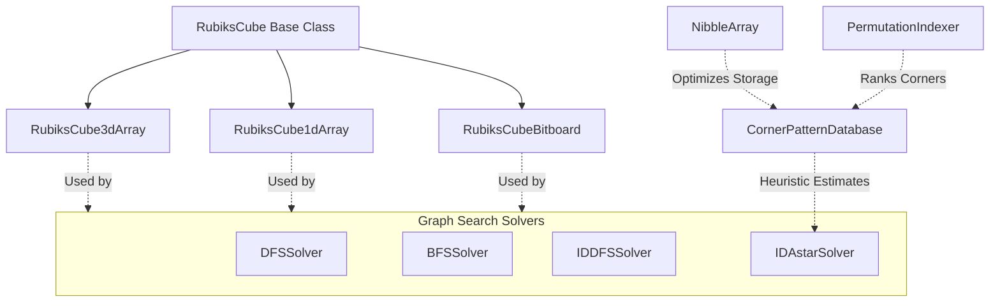

# 🧩 Rubik's Cube Solver in C++

A high-performance C++ implementation of a Rubik's Cube solver utilizing multiple state representation models and search algorithms. The solver achieves optimal solutions in seconds by employing the **Iterative Deepening A* (IDA\*)** search algorithm guided by a precomputed **Corner Pattern Database** heuristic.

---

## 🏗️ Architecture & Design

The repository is modularly structured into three core components:
1. **Cube Models**: Object-oriented models representing the cube's state and moves.
2. **Search Solvers**: Graph search algorithms to find paths from a shuffled state to the solved state.
3. **Pattern Databases**: Precomputed lookups that provide admissible heuristic estimates for IDA\*.



---

## 🗂️ Project Structure

- 📂 [Model](file:///c:/Users/prana/Desktop/rubiks-cube-solver-main/Model): Core representations of the Rubik's Cube.
  - [RubiksCube.h](file:///c:/Users/prana/Desktop/rubiks-cube-solver-main/Model/RubiksCube.h) / [RubiksCube.cpp](file:///c:/Users/prana/Desktop/rubiks-cube-solver-main/Model/RubiksCube.cpp): Base class establishing enum definitions (`FACE`, `COLOR`, `MOVE`), random shuffle logic, move translation, and printing routines.
  - [RubiksCube3dArray.cpp](file:///c:/Users/prana/Desktop/rubiks-cube-solver-main/Model/RubiksCube3dArray.cpp): Intuitive 3D character array representation (`char cube[6][3][3]`).
  - [RubiksCube1dArray.cpp](file:///c:/Users/prana/Desktop/rubiks-cube-solver-main/Model/RubiksCube1dArray.cpp): Flattened 1D character array representation (`char cube[54]`).
  - [RubiksCubeBitboard.cpp](file:///c:/Users/prana/Desktop/rubiks-cube-solver-main/Model/RubiksCubeBitboard.cpp): High-performance bitboard representation (`uint64_t bitboard[6]`).
- 📂 [Solver](file:///c:/Users/prana/Desktop/rubiks-cube-solver-main/Solver): Search algorithms for solving the cube.
  - [DFSSolver.h](file:///c:/Users/prana/Desktop/rubiks-cube-solver-main/Solver/DFSSolver.h): Depth-First Search with a fixed depth bound.
  - [BFSSolver.h](file:///c:/Users/prana/Desktop/rubiks-cube-solver-main/Solver/BFSSolver.h): Breadth-First Search using queues and back-pointer tracking for optimal path reconstruction.
  - [IDDFSSolver.h](file:///c:/Users/prana/Desktop/rubiks-cube-solver-main/Solver/IDDFSSolver.h): Iterative Deepening Depth-First Search.
  - [IDAstarSolver.h](file:///c:/Users/prana/Desktop/rubiks-cube-solver-main/Solver/IDAstarSolver.h): Iterative Deepening A\* solver powered by pattern databases.
- 📂 [PatternDatabases](file:///c:/Users/prana/Desktop/rubiks-cube-solver-main/PatternDatabases): Precomputation and database management.
  - [PatternDatabase.h](file:///c:/Users/prana/Desktop/rubiks-cube-solver-main/PatternDatabases/PatternDatabase.h) / [PatternDatabase.cpp](file:///c:/Users/prana/Desktop/rubiks-cube-solver-main/PatternDatabases/PatternDatabase.cpp): Abstract pattern database mapping states to minimum moves.
  - [CornerPatternDatabase.h](file:///c:/Users/prana/Desktop/rubiks-cube-solver-main/PatternDatabases/CornerPatternDatabase.h) / [CornerPatternDatabase.cpp](file:///c:/Users/prana/Desktop/rubiks-cube-solver-main/PatternDatabases/CornerPatternDatabase.cpp): Specific database for tracking corner permutations and orientations.
  - [CornerDBMaker.h](file:///c:/Users/prana/Desktop/rubiks-cube-solver-main/PatternDatabases/CornerDBMaker.h) / [CornerDBMaker.cpp](file:///c:/Users/prana/Desktop/rubiks-cube-solver-main/PatternDatabases/CornerDBMaker.cpp): Populates the corner database using a Breadth-First Search from the solved state.
  - [NibbleArray.h](file:///c:/Users/prana/Desktop/rubiks-cube-solver-main/PatternDatabases/NibbleArray.h) / [NibbleArray.cpp](file:///c:/Users/prana/Desktop/rubiks-cube-solver-main/PatternDatabases/NibbleArray.cpp): Custom 4-bit array storage implementation to compress memory by 50%.
  - [PermutationIndexer.h](file:///c:/Users/prana/Desktop/rubiks-cube-solver-main/PatternDatabases/PermutationIndexer.h): Lexicographical ranking of corner permutations via Lehmer code calculation in $O(N)$ time.
  - [math.h](file:///c:/Users/prana/Desktop/rubiks-cube-solver-main/PatternDatabases/math.h) / [math.cpp](file:///c:/Users/prana/Desktop/rubiks-cube-solver-main/PatternDatabases/math.cpp): Factorial, permutation (pick), and combination (choose) utilities.
- 📂 [Databases](file:///c:/Users/prana/Desktop/rubiks-cube-solver-main/Databases): Serialized heuristic database files.
  - [cornerDepth5V1.txt](file:///c:/Users/prana/Desktop/rubiks-cube-solver-main/Databases/cornerDepth5V1.txt): Precomputed database storing corner configuration moves (up to depth 8).
- ⚙️ [CMakeLists.txt](file:///c:/Users/prana/Desktop/rubiks-cube-solver-main/CMakeLists.txt): Build system file definition.
- 🚀 [main.cpp](file:///c:/Users/prana/Desktop/rubiks-cube-solver-main/main.cpp): Entry point executing testing runs and demonstrating solvers.

---

## 📈 State Representation Models

To optimize the search phase, the project tests three different representations of the 3x3x3 Rubik's cube state:

| Representation | Underlying Data Structure | Hash Efficiency | Speed Performance | Description |
| :--- | :--- | :--- | :--- | :--- |
| **3D Array** | `char cube[6][3][3]` | 🛑 Low (String hashing) | 🛑 Slow | Highly intuitive layout mapping faces directly. High memory overhead and indexing lookup costs. |
| **1D Array** | `char cube[54]` | ⚠️ Moderate (String hashing) | ⚠️ Moderate | Flattened representation avoiding multi-dimensional overhead, but still bottlenecked by std::hash on strings. |
| **Bitboard** | `uint64_t bitboard[6]` | 🚀 High (XOR arithmetic) | 🚀 Very Fast | Represents each face's 8 outer boundary stickers as bits. Face rotations and side shifts are performed using fast logical bitwise operations. |

### The Bitboard Advantage
In [RubiksCubeBitboard.cpp](file:///c:/Users/prana/Desktop/rubiks-cube-solver-main/Model/RubiksCubeBitboard.cpp), each color index is represented by an 8-bit block (since the center of each face is stationary, we only track the 8 boundary stickers). This fits perfectly in a single 64-bit integer (`uint64_t`) per face. Face rotation is equivalent to shifting the bitboard:
$$\text{New Side} = (\text{Side} \ll 16) \mid (\text{Side} \gg 48)$$
This eliminates complex nested loops and allows millions of state transitions per second.

---

## 🔍 Solvers Overview

1. **DFS Solver (`DFSSolver`)**:
   - Depth-first search traversal.
   - Best when search depth is strictly constrained.
   - Scales poorly ($O(18^D)$ branching factor) without heuristics.
2. **BFS Solver (`BFSSolver`)**:
   - Explores levels sequentially.
   - Guarantees finding the shortest solution.
   - Bottlenecked by exponential memory growth due to tracking the `visited` states.
3. **IDDFS Solver (`IDDFSSolver`)**:
   - Repeatedly runs DFS with increasing depth limits.
   - Combines DFS space efficiency ($O(D)$) with BFS optimality (guaranteed shortest path).
4. **IDA\* Solver (`IDAstarSolver`)**:
   - Performs iterative deepening search using $f(n) = g(n) + h(n)$, where $g(n)$ is the path cost (depth) and $h(n)$ is the heuristic estimation from the corner database.
   - Prunes paths where $g(n) + h(n) > \text{bound}$, allowing deep shuffles to be solved efficiently.

---

## 🧠 Heuristics and Pattern Databases

An admissible heuristic is required for the A\* search to guarantee optimal results. This project uses the **Corner Pattern Database** which computes the exact number of moves needed to solve only the corner pieces.

### Database Indexing Theory
There are 8 corners on a Rubik's Cube. 
1. **Permutations**: The 8 corner pieces can be permuted in $8! = 40,320$ ways. The index is mapped using Lehmer codes via [PermutationIndexer.h](file:///c:/Users/prana/Desktop/rubiks-cube-solver-main/PatternDatabases/PermutationIndexer.h) in $O(N)$ time.
2. **Orientations**: Each corner has 3 potential orientations. Since the orientation of 7 corners uniquely determines the 8th, there are $3^7 = 2,187$ distinct orientation states.
3. **Total Database States**: 
   $$\text{Total States} = 8! \times 3^7 = 40,320 \times 2,187 = 88,179,840 \text{ states}$$

> [!NOTE]
> The database implementation in [CornerPatternDatabase.cpp](file:///c:/Users/prana/Desktop/rubiks-cube-solver-main/PatternDatabases/CornerPatternDatabase.cpp#L7) allocates `100,179,840` slots instead of `88,179,840`, providing a padded storage layout.

### Memory Optimization: Nibble Array
An `88,179,840` array of 8-bit bytes would consume **88 MB** of memory. Since the minimum moves to solve the corners are always under 15, we only need 4 bits (a "nibble", values `0x0` to `0xF`) per entry.
The custom [NibbleArray.cpp](file:///c:/Users/prana/Desktop/rubiks-cube-solver-main/PatternDatabases/NibbleArray.cpp) packs two states into one byte:
- **Even position**: `val >> 4`
- **Odd position**: `val & 0x0F`
This slashes memory usage in half to **~44 MB** (or **~50 MB** with padding), allowing the database to easily fit in CPU cache.

### Database Generation
The database is built via [CornerDBMaker.cpp](file:///c:/Users/prana/Desktop/rubiks-cube-solver-main/PatternDatabases/CornerDBMaker.cpp) using a Breadth-First Search (BFS) from the solved state up to depth 8. Any state not reached in 8 moves defaults to a heuristic estimate of `8` (making it a consistent and admissible heuristic).

---

## 🛠️ Build and Compilation

### Prerequisites
- A C++14 compliant compiler (GCC, Clang, or MSVC)
- CMake 3.20 or higher

### Steps to Build
1. Open a terminal/shell in the project root directory.
2. Create a build directory and run CMake:
   ```bash
   mkdir build
   cd build
   cmake ..
   ```
3. Compile the executable:
   ```bash
   cmake --build . --config Release
   ```

---

## 🚀 Usage Example

The [main.cpp](file:///c:/Users/prana/Desktop/rubiks-cube-solver-main/main.cpp) file is set up to load a precomputed corner database, shuffle the Rubik's cube, and solve it:

```cpp
#include "Model/RubiksCubeBitboard.cpp"
#include "Solver/IDAstarSolver.h"

int main() {
    string fileName = "Databases/cornerDepth5V1.txt";
    
    // Create a bitboard cube representation
    RubiksCubeBitboard cube;
    
    // Shuffle the cube randomly with 13 moves
    auto shuffleMoves = cube.randomShuffleCube(13);
    cube.print();
    
    // Solve using IDA* Search guided by the Pattern Database
    IDAstarSolver<RubiksCubeBitboard, HashBitboard> idaStarSolver(cube, fileName);
    auto moves = idaStarSolver.solve();
    
    // Print the solution moves
    for (auto move : moves) {
        cout << cube.getMove(move) << " ";
    }
    cout << "\n";
    
    return 0;
}
```